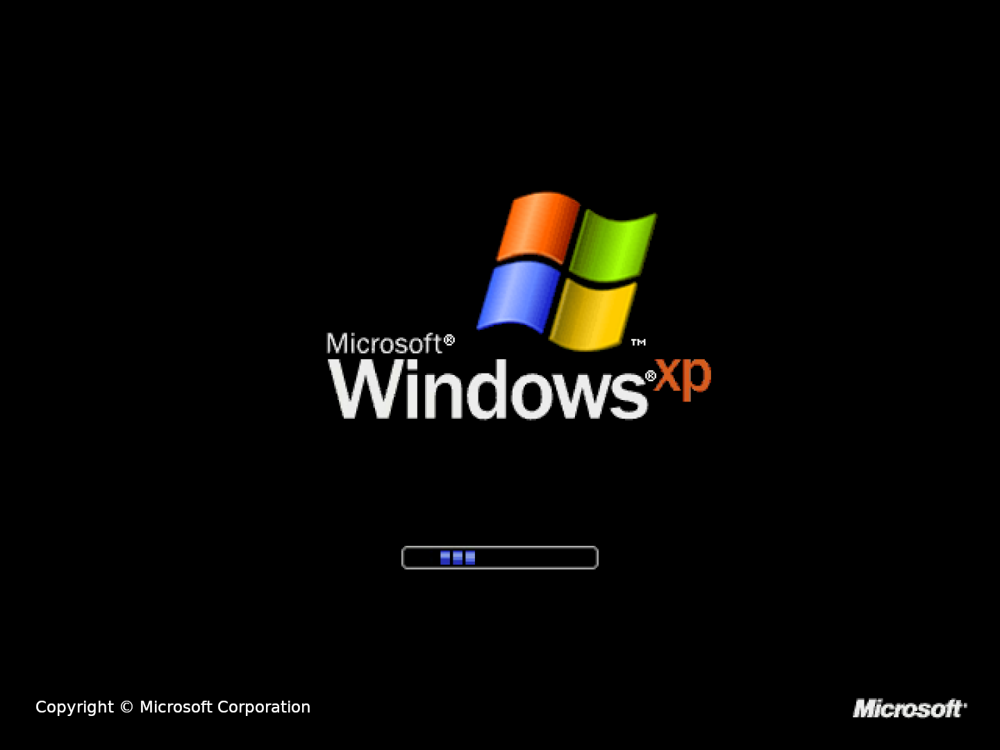

# WindozeXP 1080 Plymouth theme

## Disclaimer

I just edited the work of LASZCZ (https://www.pling.com/p/1202116/)

Edits from original :
- Scaled it to 1080p.
- Added some loading frames to complete the progress bar cicle.
- Translated the copyright to english.
- Moved the progress bar down a little to match the original XP loading screen.

## Installation

Just run `./install` to install it.
You can run `./test-plymouth` to display the current bootsplash theme.

## Screenshot

